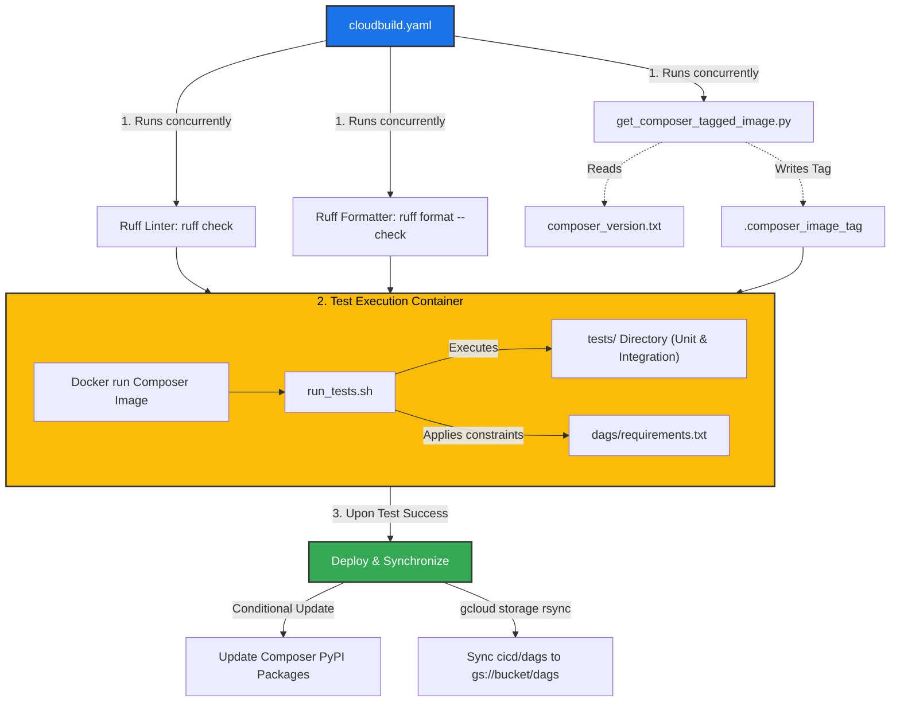
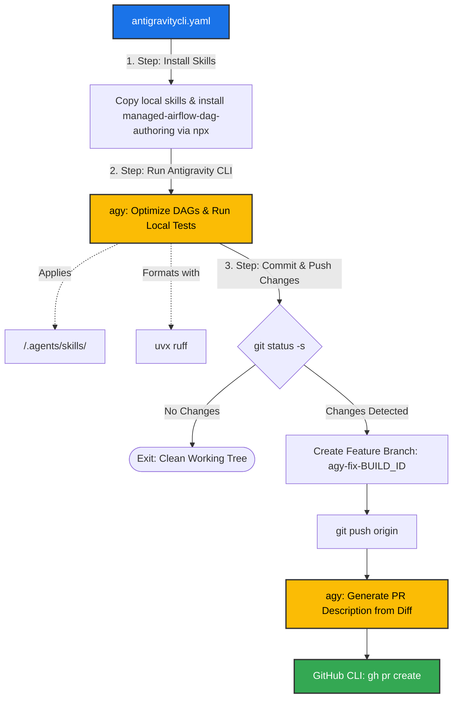

# Cloud Composer CI/CD & Automation Suite

[](https://shell.cloud.google.com/cloudshell/editor?cloudshell_git_repo=https%3A%2F%2Fgithub.com%2FGoogleCloudPlatform%2Fcomposer-utilities.git&cloudshell_workspace=cicd%2F)

This directory contains the automation, testing, and continuous integration/continuous deployment (CI/CD) pipelines for managing Apache Airflow DAGs and dependencies in Google Cloud Composer environments.

---

## Directory Structure

```
cicd/
├── cloudbuild.yaml                  # Main Cloud Build CI/CD pipeline (lint, test, deploy)
├── run_tests.sh                     # Test runner executing inside the Cloud Composer Docker container
├── composer_version.txt             # Target Cloud Composer & Airflow version definition
├── get_composer_tagged_image.py     # Resolves the Artifact Registry Composer container image tag
├── dags/                            # Composer DAGs folder synchronized to environments
│   ├── airflow2_example_python_operator.py    # Airflow 2/3 migration example for PythonOperator
│   ├── airflow2_example_schedule_interval.py  # Airflow 2/3 migration example for schedule & EmptyOperator
│   ├── bq_1000_queries_fast_parse.py          # High-performance BigQuery DAG using Dynamic Task Mapping
│   ├── bq_1000_queries_slow_parse.py          # Optimized BigQuery DAG demonstrating fast parsing techniques
│   ├── requirements.txt                       # PyPI dependencies synchronized to Composer environments
│   ├── sleepy_dynamic_task_mapping.py         # KubernetesPodOperator with dynamic task mapping
│   └── sleepy_task_group.py                   # Custom TaskGroup, dynamic mapping, and Param controls
├── tests/                           # Testing suite validating DAGs and Airflow runtime behavior
│   ├── unit/
│   │   └── test_unit.py             # Static validation: DagBag imports, SLA parse times, start dates, DAG owners, KPO namespaces
│   └── integration/
│       └── test_integration.py      # Dynamic REST API validation: DAG unpausing, triggers, polling, and auth (AF2/AF3)
└── gemini_fixes/                    # Automated code optimization & PR workflow using Antigravity CLI
    ├── antigravitycli.yaml          # Cloud Build pipeline that uses Antigravity CLI to optimize code and open PRs
    └── .agents/
        └── skills/
            ├── airflow-best-practices/        # Optimization rules (top-level code, idempotency, retries, etc.)
            │   └── SKILL.md
            └── local-airflow-unit-tests/      # Docker-based local test execution and debugging guide
                └── SKILL.md
```

---

## 1. Main CI/CD Pipeline (`cloudbuild.yaml`)

The main Cloud Build pipeline coordinates static checks, containerized test execution inside matching Composer images (via Docker without nested child builds), and automated multi-region deployment.



### Execution Steps
1. **Linting and Formatting Checks**:
   - Concurrently executes `ruff check cicd` and `ruff format --check cicd` using container `ghcr.io/astral-sh/ruff` to enforce PEP 8 style, import sorting, and code quality.
2. **Resolve Composer Docker Image**:
   - Executes `cicd/get_composer_tagged_image.py`, which reads `cicd/composer_version.txt` and writes the fully-qualified Artifact Registry image URI into `/workspace/.composer_image_tag`.
3. **Execute Testing Container Directly via Docker**:
   - Launches the resolved Cloud Composer Docker image using `docker run --rm -v /workspace:/workspace -w /workspace --entrypoint /bin/bash "$COMPOSER_TAGGED_IMAGE" /workspace/cicd/run_tests.sh`.
   - Runs `cicd/run_tests.sh` directly within the identical environment of the target Composer release, streaming logs straight to Cloud Build without spawning nested child builds.
4. **Deploy and Synchronize**:
   - **Gated Execution**: Only executes if linting, formatting, and all unit/integration tests pass.
   - **PyPI Package Updates**: Inspects `cicd/dags/requirements.txt`. If non-empty, non-comment packages exist, invokes `gcloud composer environments update --update-pypi-packages-from-file cicd/dags/requirements.txt`.
     - Implements automatic retry handling if the environment is in an `UPDATING` state (retrying every 60 seconds).
     - Gracefully ignores "No change in configuration" outputs without failing the build.
     - Skips the PyPI update step if no packages are declared in `requirements.txt`.
   - **DAG Synchronization**: Runs `gcloud storage rsync --recursive --delete-unmatched-destination-objects cicd/dags gs://${bucket}/dags` to mirror the DAGs directory to each Composer environment's Cloud Storage bucket, removing obsolete files.
   - **Multi-Region Concurrent Updates**: Concurrently queries and updates all Composer environments across the regions specified by the `_MANAGED_AIRFLOW_LOCATIONS` substitution (defaults to `us-east4 us-central1`).
   - **Build Configuration**: Uses machine type `E2_HIGHCPU_32`, log streaming to Cloud Logging (`CLOUD_LOGGING_ONLY`), and a 4-hour timeout (`14400s`).

---

## 2. Containerized Test Runner (`run_tests.sh`)

This script executes inside the target Cloud Composer Docker container (in `cloudbuild.yaml`, via Antigravity CLI, or locally) to ensure exact runtime parity with the production Composer environment.

### Execution Steps
1. **Dynamic Path Resolution**: Detects whether the workspace is mounted at `/workspace/cicd`, `/workspace`, or invoked relative to the script location.
2. **Python & Airflow Environment Initialization**:
   - Sets `PYTHONUSERBASE=/home/airflow/.local` and prepends it to `PATH`.
   - Sets `AIRFLOW_HOME=/home/airflow/airflow`, `AIRFLOW__CORE__LOAD_EXAMPLES=False`, and disables `.pyc` generation via `PYTHONDONTWRITEBYTECODE=1`.
3. **Dependency Constraints & Installation**:
   - Freezes current container package versions to `/tmp/constraints.txt` via `pip list --format=freeze`.
   - Removes `apache-airflow-providers-google` from constraints to allow version upgrades defined in `cicd/dags/requirements.txt`.
   - Installs `pytest` and any libraries listed in `requirements.txt` using `--user --no-cache-dir --constraint /tmp/constraints.txt` to prevent dependency conflicts with pre-installed Composer libraries.
4. **Airflow 3 UI Asset Directory Setup**:
   - Pre-creates `SITE_PACKAGES/airflow/api_fastapi/auth/managers/simple/ui/dist` with `chown -R airflow:` to avoid write-permission errors when Airflow 3 Simple Auth Manager initializes UI assets at runtime.
5. **Airflow 2 Compatibility Configuration**:
   - Sets `AIRFLOW__API__AUTH_BACKENDS=airflow.api.auth.backend.basic_auth`.
   - Points `AIRFLOW__CORE__DAGS_FOLDER` to the resolved DAGs directory.
6. **Launch Background Standalone Airflow**:
   - Starts Airflow via `airflow standalone > /dev/null &`.
   - Polls `airflow db check` until the metadata database is ready.
   - Polls `http://localhost:8080` (up to 60 retries / 120 seconds) until the webserver is ready to accept REST API connections.
7. **DAG Verification & Pytest Execution**:
   - Executes `airflow dags list` to log parsed DAGs and surface any immediate syntax issues.
   - Executes Pytest: `python3 -m pytest -o cache_dir=/tmp/.pytest_cache -vv -s "$TESTS_DIR"`.

---

## 3. Testing Suite (`tests/`)

The test suite validates both static configurations and dynamic task executions.

### Unit Tests (`tests/unit/test_unit.py`)
- **DagBag Non-Empty**: Asserts `dagbag.size() > 0` to ensure DAGs are successfully discovered.
- **Import Error Detection**: Verifies `dagbag.import_errors == {}` ensuring that no Python syntax or module loading errors exist.
- **DAG ID & Filename Alignment**: Asserts that every DAG's `dag_id` strictly matches its file stem (`Path(dag.relative_fileloc).stem`).
- **Static Start Dates**: Asserts that all DAGs define a fixed, static `start_date` (preventing dynamic shifting dates such as `days_ago` or `datetime.now()`).
- **DAG Ownership**: Asserts that all DAGs have an owner assigned to their `owner` property.
- **DAG Parsing SLA Threshold**: Checks the duration required by the scheduler to parse each DAG file (`dagbag.dagbag_stats`), asserting that parsing takes less than `PARSING_DURATION_THRESHOLD = 2.5` seconds to prevent scheduler CPU starvation.
- **DAG Graph & Structure Validation**:
  - `test_sleepy_dynamic_task_mapping_structure`: Asserts DAG contains `>= 2` tasks and includes `sleep_for.sleepy_pod`.
  - `test_sleepy_task_group_structure`: Asserts DAG contains `>= 3` tasks.
- **Tags & Default Arguments Verification**:
  - Validates expected tags on `sleepy_task_group` (`taskgroup`, `test`, `dynamic_task_mapping`).
  - Validates `default_args` on `sleepy_dynamic_task_mapping` (`retries >= 3`).
- **Task Properties**: Checks specific task attributes such as container image (`gcr.io/google.com/cloudsdktool/google-cloud-cli:latest`) and namespace.
- **KubernetesPodOperator Namespace Enforcement**: Scans all tasks in all DAGs to verify that any `KubernetesPodOperator` explicitly specifies `namespace="composer-user-workloads"` (a critical Cloud Composer requirement).

### Integration Tests (`tests/integration/test_integration.py`)
- **Dual Airflow 2 & 3 REST API Support**:
  - **Airflow 3**: Uses API endpoint `/api/v2`, reads the generated password from `AIRFLOW_HOME/simple_auth_manager_passwords.json.generated`, retrieves a JWT bearer token via `POST /auth/token`, and attaches a UTC `logical_date` timestamp when triggering DAG runs.
  - **Airflow 2**: Uses API endpoint `/api/v1`, reads the admin password from `AIRFLOW_HOME/standalone_admin_password.txt`, and uses HTTP Basic Authentication.
- **Programmatic DAG Unpausing**: Unpauses all DAGs prior to testing using wildcard pattern `PATCH /dags?dag_id_pattern=%` with payload `{"is_paused": false}`.
- **Trigger, Diagnostic Reporting, and Polling**:
  - Waits for target DAG to become visible in the REST API (`GET /dags/{dag_id}`).
  - Triggers DAG runs (`POST /dags/{dag_id}/dagRuns`) with optional runtime configuration parameters.
  - If triggering fails, queries `GET /importErrors` to output diagnostic error traces.
  - Polls DAG run state every 2 seconds (up to 15 minutes / 450 retries).
  - Asserts that the final DAG run state is `success`.
- **End-to-End Execution**: Validates end-to-end execution of `sleepy_task_group` with parameters `conf={"seconds_to_sleep": 1, "number_of_sleepy_tasks": 1}`.

---

## 4. Included Example DAGs (`cicd/dags/`)

The `cicd/dags/` folder includes production-grade DAG patterns demonstrating modern Airflow features, performance optimizations, and migration best practices:

| DAG File | Description & Best Practice Highlights |
| :--- | :--- |
| `airflow2_example_python_operator.py` | **Airflow 2 to 3 Migration**: Demonstrates migrating to `airflow.operators.python.PythonOperator`, replacing deprecated `execution_date` with `logical_date`, removing deprecated `provide_context=True`, and using static `datetime` start dates. |
| `airflow2_example_schedule_interval.py` | **Airflow 2 to 3 Migration**: Demonstrates migrating from `schedule_interval` to `schedule`, replacing deprecated `DummyOperator` with `EmptyOperator`, and using static `start_date`. |
| `bq_1000_queries_fast_parse.py` | **High-Performance Dynamic Queries**: Employs Dynamic Task Mapping (`.expand()`) and the TaskFlow API (`@task`) to generate 1,000 BigQuery queries at runtime while parsing in well under 2.5 seconds. |
| `bq_1000_queries_slow_parse.py` | **Scheduler Optimization**: Demonstrates the remediation of a common antipattern (static Python loops creating 1,000 operator instances at parse time) by replacing it with dynamic task mapping to eliminate scheduler parse latency. |
| `sleepy_dynamic_task_mapping.py` | **KubernetesPodOperator & TaskFlow**: Demonstrates dynamically mapped TaskFlow task groups running containerized tasks with `KubernetesPodOperator`, resource constraints, retries, and the mandatory `composer-user-workloads` namespace. |
| `sleepy_task_group.py` | **Custom TaskGroups & DAG Params**: Demonstrates custom `TaskGroup` subclasses (`CustomSleepyTaskGroup`), runtime DAG parameters (`Param`), dynamic mapping over task groups, and lazy sequence evaluation. |
| `requirements.txt` | **Environment Dependencies**: Package definitions synchronized to target Composer environments via `gcloud composer environments update`. |

---

## 5. Helper Scripts & Configuration

### `composer_version.txt`
Specifies the target Cloud Composer image version string (defaults to `composer-3-airflow-3.3.1-build.0`). Update this file to match your production environment version. Image versions can be found in the [Cloud Composer version list](https://docs.cloud.google.com/composer/docs/composer-versions#images).

### `get_composer_tagged_image.py`
A Python utility that:
1. Reads the target version string from `cicd/composer_version.txt` (resolving paths whether executed locally or inside `/workspace`).
2. Supports both Composer 2 (dash-separated Airflow version) and Composer 3 (dot-separated Airflow version) image naming conventions.
3. Outputs the fully qualified Google Cloud Artifact Registry container image URI:
   ```
   us-docker.pkg.dev/cloud-airflow-releaser/airflow-worker-scheduler-{dashed_airflow_v}/airflow-worker-scheduler-{dashed_airflow_v}:{image_tag}
   ```

---

## 6. Local Testing & Development

You can run the full test suite and linters locally using Docker and Ruff to verify changes before pushing:

### 1. Run Linting and Formatting Checks
```bash
# From the repository root
uvx ruff check cicd
uvx ruff format --check cicd
```

To automatically format code and apply safe fixes:
```bash
uvx ruff check --fix cicd
uvx ruff format cicd
```

### 2. Resolve the Target Composer Docker Image
```bash
IMAGE_TAG=$(python3 cicd/get_composer_tagged_image.py)
echo "Target Image: $IMAGE_TAG"
```

### 3. Run Containerized Tests Locally
You can run the tests non-interactively in Docker:
```bash
docker run --rm \
  -v $(pwd):/workspace \
  -w /workspace \
  --entrypoint /bin/bash \
  "$IMAGE_TAG" \
  /workspace/cicd/run_tests.sh
```

Or start an interactive container session to debug tests:
```bash
docker run -it --rm \
  -v $(pwd):/workspace \
  -w /workspace \
  --entrypoint /bin/bash \
  "$IMAGE_TAG"

# Once inside the container:
/workspace/cicd/run_tests.sh
```

---

## 7. Antigravity CLI Optimization Workflow (`gemini_fixes/`)

The `gemini_fixes/` directory provides an automated code analysis, optimization, and pull request generation pipeline using Antigravity CLI and Gemini models.

### Workflow Configuration (`antigravitycli.yaml`)



### Pipeline Execution Steps
1. **Install Agent Skills**:
   - Copies local skills from `cicd/gemini_fixes/.agents/skills/*` into the workspace `.agents/skills/`.
   - Uses `npx -y skills add google/skills --skill managed-airflow-dag-authoring --agent antigravity-cli -y` to install the official managed Airflow DAG authoring skill.
2. **Run Antigravity CLI for Optimization and Tests**:
   - Downloads and installs Antigravity CLI (`curl -fsSL https://antigravity.google/cli/install.sh | bash`).
   - Invokes `agy` configured with `Gemini 3.7 Flash (High)` (`--model="Gemini 3.7 Flash (High)" --add-dir /workspace --dangerously-skip-permissions --print-timeout=2h`).
   - Executes `/local-airflow-unit-tests` prompt to optimize DAGs, pass all unit/integration tests in the Composer container, and auto-format modified files with `uvx ruff`.
3. **Commit, Push, and Pull Request Creation**:
   - Cleans up temporary skill directories (`.agents`, `.claude`, `skills-lock.json`).
   - Checks `git status -s`. If modifications exist:
     - Creates branch `agy-fix-${BUILD_ID}`.
     - Commits and pushes changes to GitHub.
     - Invokes `agy` to generate a detailed Markdown PR summary from `git diff HEAD~1..HEAD`.
     - Opens a Pull Request using GitHub CLI (`gh pr create`) using secret `antigravity-cli-github-token` from Secret Manager.

### Agent Skills (`gemini_fixes/.agents/skills/`)

#### 1. Airflow Best Practices (`airflow-best-practices/SKILL.md`)
Validates and refactors DAG code against 8 core architectural rules:
1. **Top-Level Code Constraints**: Eliminates expensive computations, network calls, and database access at top-level Python scope to keep scheduler parsing fast.
2. **Connections and Variables Management**: Forbids top-level `Variable.get()` / `Connection.get()`, deferring retrieval to execution time or Jinja templating (`{{ var.value.my_var }}`).
3. **Idempotency**: Enforces deterministic re-runs using UPSERTs, partition overwrites, and execution-date parameterization (`{{ ds }}`).
4. **Static Start Dates**: Replaces dynamic start dates (e.g. `days_ago`, `datetime.now()`) with static dates and disables unwanted `catchup`.
5. **Lightweight XCom Usage**: Disallows passing large payloads (DataFrames) through metadata DB XComs, routing them through GCS instead.
6. **Default Arguments & Retries**: Enforces standard `retries` (2–3) and `retry_delay` in `default_args`.
7. **TaskFlow API Adoption**: Recommends `@task` and `@dag` decorators for clean, Pythonic dependencies.
8. **Granular and Atomic Tasks**: Separates monolithic extract-transform-load tasks into distinct atomic steps.

#### 2. Local Airflow Unit Tests (`local-airflow-unit-tests/SKILL.md`)
Provides the agent with instructions on running tests in Docker, reproducing failures, and guidelines for resolving issues:
- Mounts `/workspace` into the Composer container.
- Freezes constraints, handles Airflow 3 UI dist assets, and boots standalone Airflow.
- Instructs the agent to preserve DAG semantic logic and avoid modifying test assertions or thresholds.

#### 3. Managed Airflow DAG Authoring (Remote Skill)
Dynamically installed from `google/skills` during Cloud Build to provide additional Google Cloud Composer best practice guidelines.

### Cleaning Up Stale Agent Branches

If running automated optimization builds produces multiple `agy-fix-*` branches, delete them from the remote repository using this script:

```bash
#!/usr/bin/env bash

# Fetch the latest remote branches and prune deleted ones
git fetch -p

# Find all remote branches starting with agy-fix-
# Uses --list to safely match origin/agy-fix-* without catching revert branches
BRANCHES=$(git branch -r --list 'origin/agy-fix-*' | sed 's#^[[:space:]]*origin/##')

if [ -z "$BRANCHES" ]; then
  echo "No matching remote branches found. Nothing to clean up!"
  exit 0
fi

echo "Found the following remote branches to delete:"
echo "$BRANCHES"
echo

# Delete all of the branches at once
echo "$BRANCHES" | xargs git push origin --delete

echo "Cleanup complete!"
```
