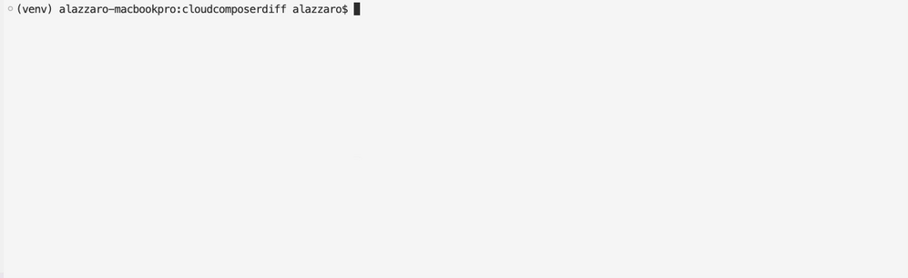
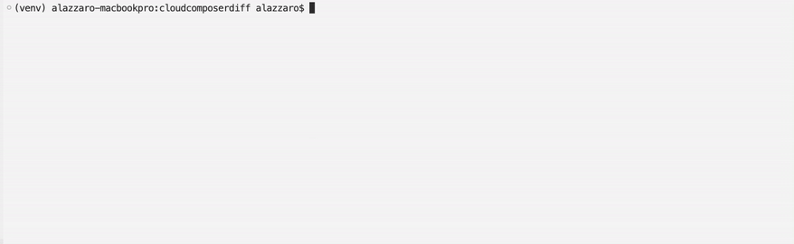

# Diff two Cloud Composer environments.

Hey there ! If you need to diff two Cloud Composer environments, this tool is for you.


As per the example above, this tool looks at various Cloud Composer environment
attributes and diffs them. It shows which attributes have different values across
environemnts, and what those values are. It also shows which attributes have a common
value across environments, and what this common value is.

When comparing two Cloud Composer environments that share no common attribute values
the "matching_value" column will be empty as per the example below:



When comparing two Cloud Composer environments that share common attributes values
the "matching_value" column will be populated and the "env_1_value" and "env_2_value"
columns will be empty. This is shown in the example below.




## Running this code

### Clone repository

[Clone the code](https://docs.github.com/en/repositories/creating-and-managing-repositories/cloning-a-repository) from GitHub to your local machine

### Install locally with pip

```
pip install cloudcomposerdiff
```

### Authorizing the application using gcloud

Install [gcloud](https://cloud.google.com/sdk/gcloud)

Select a user which has access to both composer environments to compare.

Wit this user account, initialize gcloud:

```
gcloud init
```

Next, authorize the application to access cloud composer environments:

```
gcloud auth application-default login
```

### Use the appplication

```
cloudcomposerdiff \
--env1_project_id <> \
--env1_location <> \
--env1_name <> \
--env2_project_id <> \
--env2_location <> \
--env2_name <>
```

## Developing this application

### Clone repository

Clone the code from GitHub to your local machine

### Getting the correct version of python with pyenv

Install [pyenv](https://github.com/pyenv/pyenv).

Use pyenv to install a suitable version of python, e.g. 3.10.0
```
$ pyenv install 3.10.0    
```

Use pyenv to switch to python 3.10.0
```
$ pyenv shell 3.10.0
```

### Create a virtual environment with venv module

```
python3 -m venv venv
```

activate the virtual environment
```
source venv/bin/activate
```
check that we are using the python of the virtual environment
```
(venv) $ which python
.../cloudcomposerdiff/venv/bin/python
```

### Install the package in editable mode

Install the package locally within the created virtual environment.

Do so in "editable mode" so that the package will reflect code changes.

Navigate to the directory containing pyproject.toml

Install all the dependcies end-users would get when running pip install

```
(venv ) $ python3 -m pip install --editable .
```
Install additiona dev only dependencies that end-users do not get
```
python -m pip install --editable .[dev]
```

with the above done, running the package will include code changes. This can
be used for testing during development.
```
cloudcomposerdiff \
--env1_project_id <> \
--env1_location <> \
--env1_name <> \
--env2_project_id <> \
--env2_location <> \
--env2_name <>
```
### Run tests w/ pytest

Navigate to the directory containing pyproject.toml
```
pytest
```

### Sort imports with isosort

Navigate to the directory containing pyproject.toml

Apply the sort to all files recurisvely

```
isort .
```

### Format the code with black

Navigate to the directory containing pyproject.toml

Apply the formatter to all files recurisvely

```shell
black .
```

### Lint the code

Navigate to the directory containing pyproject.toml

Apply the formatter to all files recurisvely

```shell
flake8 --max-line-length=88 src
```

### Adding futher dependencies

Do not add dependencies by editing the requirements.txt file.

Please edit the pyproject.toml file.

For end-user dependencies edit the project.dependencies section.

For dev-only edit project.optional-dependencies.dev section.

### Update requirements.txt

Do not manually update requirements.txt

Use a pip-tools command to sync pyproject.toml to requirements.txt
```shell
pip-compile pyproject.toml
```

### Update the version number of the package

Use bumpver to incrase the verion number

A MAJOR.MINOR.PATCH approach is used to versioning

E.g. to preview an increase to minor 

```shell
bumpver update --minor --dry
```

E.g. to actually increase minor 

```shell
bumpver update --minor
```

bumpver will go and update the verion number whever it appears in the package.