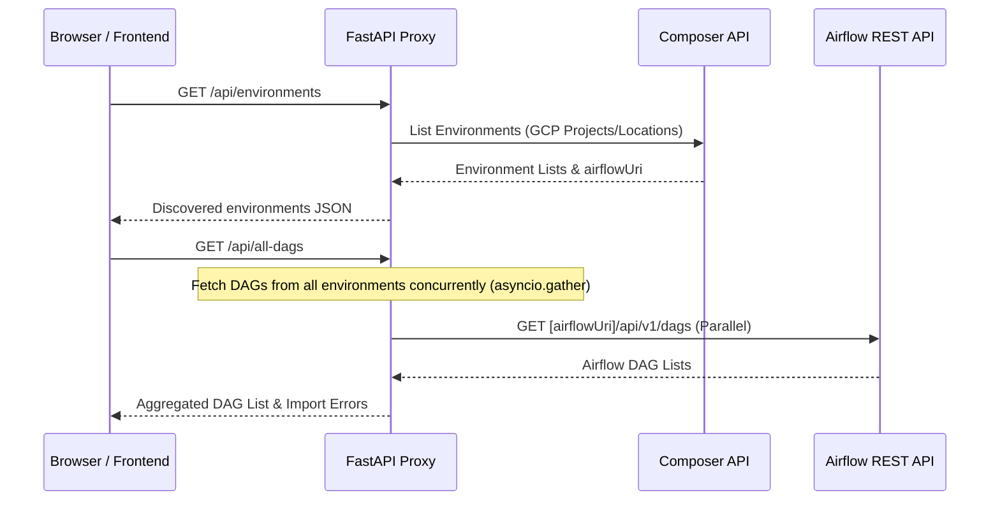
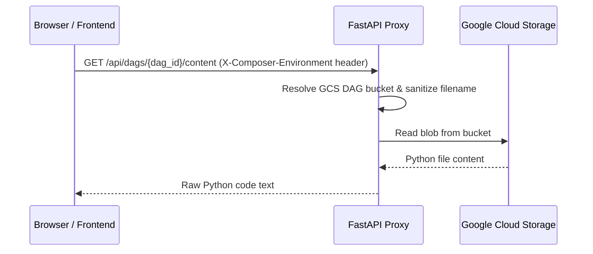

# Google Cloud Composer Control Panel

A React-based administration dashboard for Google Cloud Composer (Apache Airflow) environments. The dashboard allows administrators and developers to monitor and manage DAGs (including pausing, unpausing, triggering runs, and performing bulk actions), view environment import errors, and edit DAG files directly in the browser across multiple GCP projects and regions from a single workspace.

The application uses a FastAPI Python proxy server to bridge authentication, fetch metadata concurrently, and manage file operations securely.

---

## Table of Contents

1. [Key Features](#key-features)
2. [Architecture Overview](#architecture-overview)
   - [IAM Bridging Pattern](#iam-bridging-pattern)
   - [Sequence Diagrams](#sequence-diagrams)
3. [Technology Stack](#technology-stack)
4. [Configuration Reference](#configuration-reference)
5. [Local Development](#local-development)
   - [Prerequisites](#prerequisites)
   - [1. Authenticate with Google Cloud](#1-authenticate-with-google-cloud)
   - [2. Run the Application](#2-run-the-application)
   - [Troubleshooting Local Dev](#troubleshooting-local-dev)
6. [Testing](#testing)
7. [Deployment to Google Cloud Run](#deployment-to-google-cloud-run)
   - [Required IAM Permissions](#required-iam-permissions)
   - [Manual Deployment](#manual-deployment)
   - [Deploying with Cloud Build](#deploying-with-cloud-build)
   - [Securely Accessing the Control Panel](#securely-accessing-the-control-panel)

---

## Key Features

*   **Multi-Environment Management:** Dynamically list and switch between multiple Cloud Composer environments.
*   **Unified DAG View:** View, pause, unpause, and trigger DAGs from all environments concurrently.
*   **In-Browser DAG Editor:** Read and write DAG python code directly to Google Cloud Storage (GCS) buckets.
*   **Airflow Operations Management:** Perform key DAG lifecycle management tasks (pause, unpause, trigger, bulk operations) directly from the dashboard.
*   **Asynchronous Data Aggregation:** Fetches metadata from all environments in parallel using Python `asyncio` and `httpx`.
*   **Containerized & Cloud Native:** Fully containerized using a multi-stage Docker build, optimized for Cloud Run.

---

## Architecture Overview

The application is split into a client-side **React Frontend** and a backend **FastAPI Proxy Server**.

```
+--------------------------------------------------------+
|                      React Frontend                    |
|  - Renders dashboard UI (React Bootstrap)               |
|  - Communicates with Proxy (base URL determined by env) |
|  - Tracks active environment via localStorage          |
+--------------------------------------------------------+
                           |
                           | HTTP Requests
                           v
+--------------------------------------------------------+
|                    FastAPI Proxy Server                |
|  - Serves compiled React assets in production          |
|  - Resolves GCP credentials (via Application Default)   |
|  - Refreshes OAuth2 access tokens lazily               |
|  - Discovers Composer environments                     |
|  - Downloads/Uploads DAGs to GCS buckets               |
|  - Proxies Airflow REST API calls                      |
+--------------------------------------------------------+
         |                       |                 |
         | Composer API          | GCS API         | Airflow REST API
         v                       v                 v
+-----------------+     +-----------------+     +-----------------+
| Google Composer |     |  Google Cloud   |     | Cloud Composer  |
| Control plane   |     |  Storage (DAGs) |     | Web Server API  |
+-----------------+     +-----------------+     +-----------------+
```

### IAM Bridging Pattern

Cloud Composer web interfaces and REST APIs require Google OAuth2 credentials to authorize incoming requests. Instead of managing OAuth2 login flows on the frontend or exposing user credentials, this dashboard utilizes the **IAM Bridging Pattern**:
1. The frontend interacts with the FastAPI proxy server locally.
2. The proxy server runs under an identity (e.g., Application Default Credentials locally, or a Cloud Run Service Account in production).
3. The proxy server requests a Google OAuth2 token with the `https://www.googleapis.com/auth/cloud-platform` scope.
4. When proxying requests to Composer APIs, the proxy server injects this token into the `Authorization: Bearer <token>` header of all requests.

### Sequence Diagrams

#### Discovering Environments & Aggregating DAGs


#### DAG Code Editor (GCS Access)


---

## Technology Stack

*   **Frontend:**
    *   React 19
    *   React Bootstrap 2 (Bootstrap 5 styling)
    *   Axios (HTTP client with custom middleware for environment header injection)
    *   React Router DOM
*   **Backend:**
    *   FastAPI (Asynchronous web framework)
    *   Uvicorn / Gunicorn (ASGI server)
    *   HTTPX (Async HTTP client)
    *   Google Cloud Client Libraries (`google-auth`, `google-cloud-storage`)

---

## Configuration Reference

The application is configured using environment variables.

| Variable | Description | Default / Fallback | Example |
| :--- | :--- | :--- | :--- |
| `COMPOSER_PROJECTS` | Comma-separated list of GCP Project IDs to scan for Composer environments. | Auto-detected using Application Default Credentials. | `project-a,project-b` |
| `COMPOSER_LOCATIONS` | Comma-separated list of GCP locations/regions to scan. | `us-central1,us-east4` | `us-central1,us-east4,us-west1` |
| `ALLOWED_ORIGINS` | Comma-separated list of additional origins allowed by CORS. | `http://localhost:3000,http://127.0.0.1:3000` | `https://control-panel.mycompany.com` |
| `PORT` | Port number to run the backend server (automatically set by Cloud Run). | `3001` (local default) | `8080` |

---

## Local Development

### Prerequisites

Make sure you have the following tools installed locally:
*   [Node.js](https://nodejs.org/) (v20+ recommended) and npm
*   [Python](https://www.python.org/) (3.12+)
*   [uv](https://github.com/astral-sh/uv) (recommended Python package installer/manager)
*   [Google Cloud SDK](https://cloud.google.com/sdk) (`gcloud`)

### 1. Authenticate with Google Cloud

Authenticate your terminal using Application Default Credentials (ADC). This allows the proxy server running on your computer to act as your GCP user identity.

```bash
gcloud auth application-default login
```

### 2. Run the Application

#### Option A: Quickstart (Helper Script)
Run the helper script which starts the frontend and proxy backend concurrently in one terminal:
```bash
./start_servers.sh
```
*   **React Frontend:** `http://localhost:3000`
*   **Python Proxy Server:** `http://localhost:3001`
*   To exit, press `Ctrl + C`. The script will terminate both background processes automatically.

#### Option B: Start Separately
If you want to view logs or debug servers independently:

1.  **Start the Python Proxy Backend:**
    ```bash
    uv run proxy_server.py
    ```
2.  **Start the React Frontend:**
    In a new terminal tab:
    ```bash
    npm install
    npm start
    ```

### Troubleshooting Local Dev

*   **Private Python Registry Authentication (401 Unauthorized):**
    If your workspace has a private Python registry configured that lacks credentials, `uv` might fail to resolve dependencies. You can force `uv` to use the public PyPI registry:
    ```bash
    uv run --default-index https://pypi.org/simple proxy_server.py
    ```
*   **Zombie Processes / Port Conflicts:**
    If the servers were terminated abruptly, you might get port allocation errors (`address already in use` on port 3000 or 3001).
    1. Identify the processes:
       ```bash
       lsof -i :3000
       lsof -i :3001
       ```
    2. Kill the PID(s):
       ```bash
       kill -9 <PID>
       ```
*   **Missing pip in Virtual Environment:**
    If using `uv` and you need `pip` explicitly, use `uv pip` instead of standard `pip`.

---

## Testing

*   **Run Frontend Tests:**
    ```bash
    npm test
    ```
*   **Run Backend Tests:**
    Ensure python dependencies are synced, then run:
    ```bash
    PYTHONPATH=. pytest
    # or using uv
    PYTHONPATH=. uv run pytest
    ```

---

## Deployment to Google Cloud Run

The application is packaged as a single Docker container. A multi-stage build compile-time builds the React static files, copy them into the FastAPI backend structure, and Uvicorn serves them as static routes in production.

### Required IAM Permissions

For the application to run successfully on Cloud Run, the Service Account assigned to the Cloud Run service must have the following IAM roles:

1.  **`roles/composer.viewer`** (Composer User/Viewer): Required to call the Composer APIs to list environments, get configurations, and access endpoint URLs.
2.  **`roles/composer.user`** (Composer User): Required to authorize and call Airflow REST API endpoints on the target Composer web servers.
3.  **`roles/storage.objectUser`** (Storage Object User) on the Composer DAG buckets: Required to view and modify DAG `.py` files inside the GCS storage.

### Manual Deployment

You can build and deploy the container manually using the Google Cloud SDK:

```bash
# 1. Build and push image to Artifact Registry
docker build -t REGION-docker.pkg.dev/PROJECT_ID/REPO_NAME/composer-control-panel:latest .
docker push REGION-docker.pkg.dev/PROJECT_ID/REPO_NAME/composer-control-panel:latest

# 2. Deploy to Cloud Run
gcloud run deploy composer-control-panel \
  --image REGION-docker.pkg.dev/PROJECT_ID/REPO_NAME/composer-control-panel:latest \
  --platform managed \
  --region REGION \
  --service-account YOUR_SERVICE_ACCOUNT_EMAIL \
  --allow-unauthenticated
```

### Deploying with Cloud Build

A [`cloudbuild.yaml`](file:///Users/ddeleo/composer-utilities/cloudbuild.yaml) file is included at the root of this repository. You can execute it to build and deploy to Cloud Run automatically:

```bash
gcloud builds submit --config=../cloudbuild.yaml \
  --substitutions=_REGION="us-central1",_REPO_NAME="composer-control-panel-repo",_SERVICE_NAME="composer-control-panel-service"
```

### Securely Accessing the Control Panel

Since the control panel provides powerful management actions, it should not be exposed to the public internet. If you deployed it as a private Cloud Run service, you can access it securely using a local `gcloud` proxy:

1.  **Start a secure local proxy tunnel:**
    ```bash
    gcloud beta run services proxy composer-control-panel-service --project=<PROJECT_ID> --region=<REGION> --port=8080
    ```
2.  **Navigate to the proxy endpoint in your browser:**
    Open [http://127.0.0.1:8080](http://127.0.0.1:8080) to access the control panel interface.