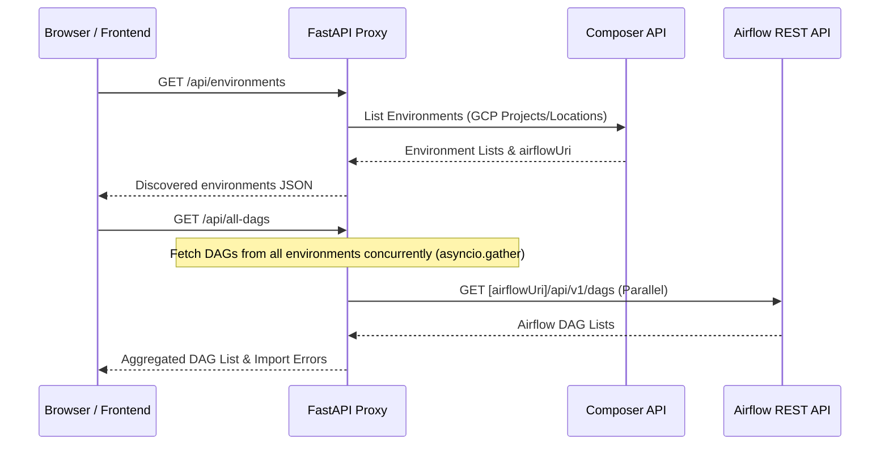
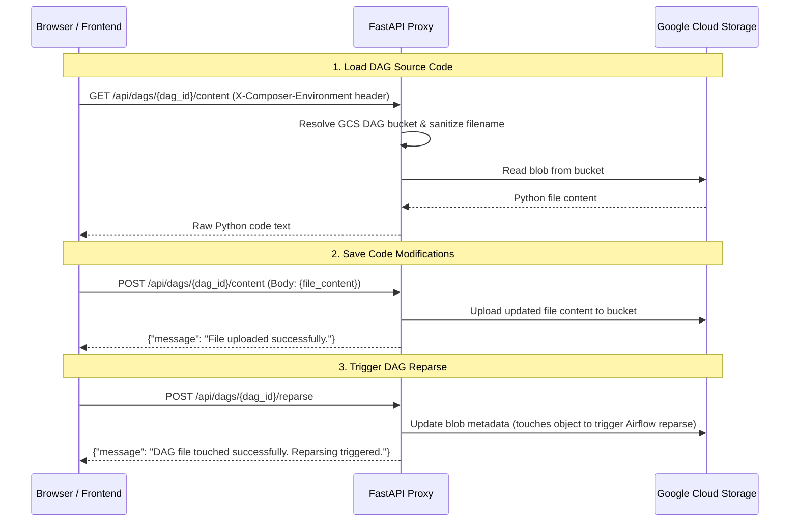

# Google Cloud Composer Control Panel

[](https://shell.cloud.google.com/cloudshell/editor?cloudshell_git_repo=https%3A%2F%2Fgithub.com%2FGoogleCloudPlatform%2Fcomposer-utilities.git&cloudshell_workspace=control_panel%2F)

A React-based administration dashboard for Google Cloud Composer (Apache Airflow) environments. The dashboard allows administrators and developers to monitor and manage DAGs (including pausing, unpausing, triggering runs, and performing bulk actions), view environment import errors, inspect and clear task instances, and edit DAG files directly in the browser across multiple GCP projects and regions from a single workspace.

The application uses a FastAPI Python proxy server to bridge authentication, fetch metadata concurrently across environments, proxy Airflow REST API calls, and manage DAG storage operations securely.

---

## Table of Contents

1. [Key Features](#key-features)
2. [Architecture Overview](#architecture-overview)
   - [IAM Bridging Pattern](#iam-bridging-pattern)
   - [Sequence Diagrams](#sequence-diagrams)
3. [Technology Stack](#technology-stack)
4. [Directory Structure](#directory-structure)
5. [Configuration Reference](#configuration-reference)
6. [Pattern Matching & Batch Operations](#pattern-matching--batch-operations)
7. [Backend API Reference](#backend-api-reference)
8. [Local Development](#local-development)
   - [Prerequisites](#prerequisites)
   - [1. Authenticate with Google Cloud](#1-authenticate-with-google-cloud)
   - [2. Run the Application](#2-run-the-application)
   - [Troubleshooting Local Dev](#troubleshooting-local-dev)
9. [Testing & Quality](#testing--quality)
10. [Deployment to Google Cloud Run](#deployment-to-google-cloud-run)
   - [Required IAM Permissions](#required-iam-permissions)
   - [Create Artifact Registry Repository](#create-artifact-registry-repository)
   - [Manual Deployment](#manual-deployment)
   - [Deploying with Cloud Build](#deploying-with-cloud-build)
   - [Securely Accessing the Control Panel](#securely-accessing-the-control-panel)

---

## Key Features

*   **Multi-Environment Management:** Dynamically list, filter, and switch between multiple Cloud Composer environments, or select **All Environments** to aggregate data across all instances.
*   **Unified DAG View:** View, search, filter by tags/name, pause, unpause, and trigger DAGs across all environments in a single consolidated interface.
*   **Pattern-Based Filtering & Batch Operations:** Filter DAGs and execute bulk actions across Airflow environments using Airflow REST API pattern parameters (`dag_id_pattern` and `dag_id_prefix_pattern`). Supports batch pause, unpause, task failure, task clearing, and DAG triggering.
*   **In-Browser Monaco DAG Editor:** View and edit DAG Python code in the browser with Monaco Editor (syntax highlighting, theme synchronization, error line indicators), save changes directly to Google Cloud Storage (GCS) DAG buckets, and trigger on-demand reparsing.
*   **On-Demand DAG Reparsing:** Touch DAG files in GCS to trigger Airflow DAG re-parsing without requiring manual GCS console navigation or file modifications.
*   **Task Instance & Mapped Task Management:** Inspect DAG task instances and clear mapped or standard task runs directly from the dashboard.
*   **Import Error Detection:** Instantly spot and inspect DAG import errors and Python syntax issues across all environments.
*   **Automatic Project Detection:** Automatically resolves the default project from active `gcloud` configuration or Application Default Credentials (ADC) if `COMPOSER_PROJECTS` is not explicitly set.
*   **Light & Dark Theme:** Built-in theme switcher with theme persistence and full dark/light styling.
*   **Asynchronous Data Aggregation:** Fetches metadata from all environments in parallel using Python `asyncio` and `httpx`.
*   **Containerized & Cloud Native:** Multi-stage Docker build ready for secure deployment on Google Cloud Run with Cloud Build configuration.

---

## Architecture Overview

The application is split into a client-side **React Frontend** and a backend **FastAPI Proxy Server**.

```
+--------------------------------------------------------+
|                      React Frontend                    |
|  - Renders dashboard UI (React Bootstrap)               |
|  - Communicates with Proxy (base URL determined by env) |
|  - Tracks active environment via localStorage          |
+--------------------------------------------------------+
                           |
                           | HTTP Requests
                           v
+--------------------------------------------------------+
|                    FastAPI Proxy Server                |
|  - Serves compiled React assets in production          |
|  - Resolves GCP credentials (via Application Default)   |
|  - Refreshes OAuth2 access tokens lazily               |
|  - Discovers Composer environments                     |
|  - Downloads/Uploads DAGs to GCS buckets               |
|  - Proxies Airflow REST API calls                      |
+--------------------------------------------------------+
         |                       |                 |
         | Composer API          | GCS API         | Airflow REST API
         v                       v                 v
+-----------------+     +-----------------+     +-----------------+
| Google Composer |     |  Google Cloud   |     | Cloud Composer  |
| Control plane   |     |  Storage (DAGs) |     | Web Server API  |
+-----------------+     +-----------------+     +-----------------+
```

### IAM Bridging Pattern

Cloud Composer web interfaces and REST APIs require Google OAuth2 credentials to authorize incoming requests. Instead of managing OAuth2 login flows on the frontend or exposing user credentials, this dashboard utilizes the **IAM Bridging Pattern**:
1. The frontend interacts with the FastAPI proxy server locally.
2. The proxy server runs under an identity (e.g., Application Default Credentials locally, or a Cloud Run Service Account in production).
3. The proxy server requests a Google OAuth2 token with the `https://www.googleapis.com/auth/cloud-platform` scope.
4. When proxying requests to Composer APIs, the proxy server injects this token into the `Authorization: Bearer <token>` header of all requests.

### Sequence Diagrams

#### Discovering Environments & Aggregating DAGs

```mermaid
sequenceDiagram
    participant User as Browser / Frontend
    participant Proxy as FastAPI Proxy
    participant Composer as Composer API
    participant Airflow as Airflow REST API

    User->>Proxy: GET /api/environments
    Proxy->>Composer: List Environments (GCP Projects/Locations)
    Composer-->>Proxy: Environment Lists & airflowUri
    Proxy-->>User: Discovered environments JSON

    User->>Proxy: GET /api/all-dags
    Note over Proxy: Fetch DAGs from all environments concurrently (asyncio.gather)
    Proxy->>Airflow: GET [airflowUri]/api/v1/dags (Parallel)
    Airflow-->>Proxy: Airflow DAG Lists
    Proxy-->>User: Aggregated DAG List & Import Errors
```

#### In-Browser DAG Editor & Reparsing

```mermaid
sequenceDiagram
    participant User as Browser / Frontend
    participant Proxy as FastAPI Proxy
    participant GCS as Google Cloud Storage

    Note over User,GCS: 1. Load DAG Source Code
    User->>Proxy: GET /api/dags/{dag_id}/content (X-Composer-Environment header)
    Proxy->>Proxy: Resolve GCS DAG bucket & sanitize filename
    Proxy->>GCS: Read blob from bucket
    GCS-->>Proxy: Python file content
    Proxy-->>User: Raw Python code text

    Note over User,GCS: 2. Save Code Modifications
    User->>Proxy: POST /api/dags/{dag_id}/content (Body: {file_content})
    Proxy->>GCS: Upload updated file content to bucket
    Proxy-->>User: {"message": "File uploaded successfully."}

    Note over User,GCS: 3. Trigger DAG Reparse
    User->>Proxy: POST /api/dags/{dag_id}/reparse
    Proxy->>GCS: Update blob metadata (touches object to trigger Airflow reparse)
    Proxy-->>User: {"message": "DAG file touched successfully. Reparsing triggered."}
```

---

## Technology Stack

*   **Frontend:**
    *   React 19 (`react`, `react-dom`)
    *   React Bootstrap 2 (Bootstrap 5 styling)
    *   Monaco Editor (browser-based code editor with Python syntax highlighting and error markers)
    *   Axios (HTTP client with custom interceptor for `X-Composer-Environment` header injection)
    *   React Router DOM 6 (client-side routing)
*   **Backend:**
    *   FastAPI (asynchronous web framework)
    *   Uvicorn / Gunicorn (ASGI server)
    *   HTTPX (asynchronous HTTP client for concurrent upstream requests)
    *   Google Cloud Client Libraries (`google-auth`, `google-api-python-client`, `google-cloud-storage`)
    *   Pytest (backend test suite)
    *   Ruff (code analysis and formatting)

---

## Directory Structure

```
control_panel/
├── Dockerfile                  # Multi-stage production container build
├── README.md                   # Control panel documentation
├── cloudbuild.yaml             # Automated Cloud Build CI/CD deployment
├── package.json                # Frontend dependencies and npm scripts
├── proxy_server.py             # FastAPI proxy backend and API endpoints
├── pyproject.toml              # Python project metadata, dependencies, and tool configuration
├── requirements.txt            # Pinned dependencies for production Docker image
├── start_servers.sh            # Local development startup script
├── public/                     # Static HTML and logo assets
├── src/                        # React frontend source code
│   ├── api/
│   │   └── axios.js            # Axios client with base URL & environment interceptor
│   ├── components/
│   │   ├── DagEditView.js      # In-browser DAG editor view
│   │   ├── EndpointView.js     # Unified DAG dashboard, operations, and modals
│   │   ├── MonacoEditor.js     # Monaco Editor wrapper component
│   │   └── Sidebar.js          # Environment selector and theme toggle
│   ├── context/
│   │   ├── EnvironmentContext.js # Active environment state management
│   │   └── ThemeContext.js       # Dark/light theme state management
│   ├── App.js                  # Main application component and routing
│   ├── apiEndpoints.js         # API endpoint definitions and metadata
│   └── setupTests.js           # Jest and React Testing Library setup
└── test_scripts/               # Backend pytest test suite
    ├── conftest.py             # Pytest fixtures and mock setup
    ├── test_auth.py            # Authentication tests
    ├── test_env.py             # Environment configuration tests
    ├── test_list_envs.py       # Environment discovery tests
    ├── test_locations.py       # Location resolution tests
    └── test_proxy_server.py    # FastAPI endpoint integration tests
```

---

## Configuration Reference

The application is configured using environment variables:

| Variable | Description | Default / Fallback | Example |
| :--- | :--- | :--- | :--- |
| `COMPOSER_PROJECTS` | Comma-separated list of GCP Project IDs to scan for Composer environments. | Auto-detected from active `gcloud` project (`gcloud config get-value project`) or Application Default Credentials (ADC). | `project-a,project-b` |
| `COMPOSER_LOCATIONS` | Comma-separated list of GCP locations/regions to scan. | `us-central1,us-east4` | `us-central1,us-east4,us-west1` |
| `ALLOWED_ORIGINS` | Comma-separated list of additional origins allowed by CORS. | `http://localhost:3000,http://127.0.0.1:3000` | `https://control-panel.mycompany.com` |
| `PORT` | Port number to run the backend server (automatically set by Cloud Run). | `3001` (local dev) / `8080` (Cloud Run) | `8080` |

---

## Pattern Matching & Batch Operations

The dashboard integrates with the Apache Airflow REST API's pattern-based filtering and batch update capabilities, enabling operators to query, pause, unpause, trigger, clear, or fail DAGs at scale across one or all Composer environments.

### Airflow Pattern Parameter Semantics

Airflow list and batch endpoints accept two pattern parameters for matching DAG IDs:

| Parameter | Type | Semantics & Behavior | Best For |
| :--- | :--- | :--- | :--- |
| `dag_id_pattern` | Substring match | Case-insensitive substring match (`SQL ILIKE '%term%'`). `%` matches any character sequence, `_` matches any single character (e.g. `%customer_%`). Cannot utilize B-tree indexes. | Ad-hoc searches across tables with small-to-medium numbers of DAGs. |
| `dag_id_prefix_pattern` | Prefix match | Matches the start of the value. Case-sensitive and index-friendly; `%` and `_` are treated as literal characters and trailing non-alphanumeric characters are stripped so the range scan remains index-compatible under locale-aware collations (e.g. `test_` matches values starting with `test`, and `s3://` matches `s3`). | High-scale environments with thousands of DAGs requiring fast index scans. |

#### Universal Pattern Rules
*   **`|` (Pipe):** Denotes logical **OR** (e.g., `dag1|dag2`).
*   **`~` (Tilde):** Matches **all** values/DAGs (e.g., `~` targets every DAG in the environment).
*   **No Regex:** Regular expressions are *not* supported by these pattern parameters.

### Dashboard Features

1.  **Unified Search & API Pattern Filter Bar:**
    *   Located directly above the DAG table, an integrated input group combines a search input, pattern type dropdown (`Pattern (ILIKE %_)` vs `Prefix Pattern`), and `Filter API` button.
    *   Typing into the input box provides immediate client-side table filtering.
    *   Clicking **Filter API** (or pressing `Enter`) dispatches a request to the backend with the active pattern parameter (`dag_id_pattern` or `dag_id_prefix_pattern`), querying the Airflow REST API directly.
    *   When active, an info banner highlights the active API filter with an option to clear it.
2.  **Batch Operations Modal:**
    *   Click the **⚡ Batch Operations by Pattern** button in the dashboard toolbar.
    *   Select between Substring Pattern (`dag_id_pattern`) and Prefix Pattern (`dag_id_prefix_pattern`).
    *   Enter a pattern with quick-insert shortcut buttons for `~` (All), `|` (OR), `%` (Wildcard), and `_` (Single char).
    *   Choose the batch action:
        *   **Pause Matching DAGs:** Executes `PATCH /api/v1/dags?{pattern_type}=...&update_mask=is_paused` with body `{"is_paused": true}`.
        *   **Unpause Matching DAGs:** Executes `PATCH /api/v1/dags?{pattern_type}=...&update_mask=is_paused` with body `{"is_paused": false}`.
        *   **Fail Running Tasks:** Queries matching DAGs and marks active task instances as failed.
        *   **Clear Tasks:** Queries matching DAGs and resets latest run task instances.
        *   **Trigger DAG Runs:** Queries matching DAGs and triggers execution runs.
    *   **Live Preview:** Click **🔍 Preview Matches via API** to inspect which DAGs match the pattern across environments prior to executing the operation.
    *   **Scope:** Target the active Composer environment or dispatch across **All Environments** concurrently.

---

## Backend API Reference

The FastAPI proxy server (`proxy_server.py`) exposes the following endpoints:

| Method | Endpoint | Description |
| :--- | :--- | :--- |
| `GET` | `/api/environments` | Lists all discovered Cloud Composer environments across configured projects and regions. |
| `GET` | `/api/environments/{name}/details` | Retrieves full environment details (including GCS DAG bucket name) for a given environment. |
| `GET` | `/api/all-dags` | Concurrently queries all discovered environments for their DAGs and import errors. Supports query parameters `dag_id_pattern` and `dag_id_prefix_pattern`. |
| `PATCH` | `/api/all-dags` | Concurrently patches DAGs matching pattern query parameters (`dag_id_pattern`, `dag_id_prefix_pattern`, `update_mask`) across all discovered environments. |
| `GET` | `/api/dags/{dag_id}/content` | Reads the Python source file for the specified DAG from its environment GCS bucket. |
| `POST` | `/api/dags/{dag_id}/content` | Writes updated Python source code back to the DAG's GCS bucket. |
| `POST` | `/api/dags/{dag_id}/reparse` | Touches the DAG blob in GCS (updates metadata) to trigger Airflow DAG re-parsing on demand. |
| `ANY` | `/api/proxy/{path:path}` | Proxies arbitrary Airflow REST API requests to the target environment's `airflowUri` with Bearer auth injection. |
| `GET` | `/{path:path}` | Serves compiled React production static files from the `build` directory, with SPA fallback to `index.html`. |

---

## Local Development

### Prerequisites

Make sure you have the following tools installed locally:
*   [Node.js](https://nodejs.org/) (v20+ recommended) and npm
*   [Python](https://www.python.org/) (3.12+)
*   [uv](https://github.com/astral-sh/uv) (recommended Python package installer/manager)
*   [Google Cloud SDK](https://cloud.google.com/sdk) (`gcloud`)

### 1. Authenticate with Google Cloud

Authenticate your terminal using Application Default Credentials (ADC). This allows the proxy server running on your machine to authenticate as your GCP user identity:

```bash
gcloud auth application-default login
```

Set your active GCP project in `gcloud` (used by default if `COMPOSER_PROJECTS` is not set):
```bash
gcloud config set project YOUR_PROJECT_ID
```

### 2. Run the Application

#### Option A: Quickstart (Helper Script)

Run the included helper script, which sets defaults and starts both servers concurrently:
```bash
./start_servers.sh
```

*   **Automatic Project Detection:** If `COMPOSER_PROJECTS` is not set, `start_servers.sh` automatically checks your default `gcloud` project and configures it.
*   **Locations:** If `COMPOSER_LOCATIONS` is unset, it defaults to `us-central1,us-east4`.
*   **React Frontend:** `http://localhost:3000`
*   **Python Proxy Server:** `http://localhost:3001`
*   **Clean Shutdown:** Press `Ctrl + C` to terminate both processes cleanly.

#### Option B: Start Separately

If you want to view logs or debug servers independently:

1.  **Start the Python Proxy Backend:**
    ```bash
    # Optionally set project(s) and location(s)
    export COMPOSER_PROJECTS="your-project-id"
    export COMPOSER_LOCATIONS="us-central1,us-east4"

    uv run proxy_server.py
    ```
2.  **Start the React Frontend:**
    In a new terminal tab:
    ```bash
    npm install
    npm start
    ```

### Troubleshooting Local Dev

*   **Private Python Registry Authentication (401 Unauthorized):**
    If your workspace has a private Python registry configured that lacks credentials, `uv` might fail to resolve dependencies. You can force `uv` to use the public PyPI registry:
    ```bash
    uv run --default-index https://pypi.org/simple proxy_server.py
    ```
*   **Zombie Processes / Port Conflicts:**
    If the servers were terminated abruptly, you might get port allocation errors (`address already in use` on port 3000 or 3001).
    1. Identify the processes:
       ```bash
       lsof -i :3000
       lsof -i :3001
       ```
    2. Terminate the PID(s):
       ```bash
       kill -9 <PID>
       ```

---

## Testing & Quality

*   **Run Frontend Tests:**
    ```bash
    npm test
    ```
*   **Run Backend Tests:**
    Backend tests in `test_scripts/` run using `pytest`:
    ```bash
    uv run pytest
    # or
    pytest
    ```
*   **Code Linting & Formatting:**
    ```bash
    uv run ruff check .
    uv run ruff format .
    ```

---

## Deployment to Google Cloud Run

The application is packaged as a single container using a multi-stage Docker build. Stage 1 compiles the React static assets with Node.js, and Stage 2 runs FastAPI and Uvicorn with Python 3.12, serving both the API endpoints and the compiled React assets from the same port.

### Required IAM Permissions

The Service Account assigned to the Cloud Run service must have the following IAM roles:

1.  **`roles/composer.viewer`** (Composer Viewer): Required to list Composer environments, retrieve environment configurations, and access endpoint URLs.
2.  **`roles/composer.user`** (Composer User): Required to authorize and invoke Airflow REST API endpoints on target Composer web servers.
3.  **`roles/storage.objectUser`** (Storage Object User) on the Composer DAG buckets: Required to view, save, and touch DAG `.py` files inside Cloud Storage.

To create the service account and grant required permissions:
```bash
# Set your project ID
PROJECT_ID="$(gcloud config get-value project)"

# Create the service account
gcloud iam service-accounts create composer \
  --display-name="Composer Control Panel Service Account"

# Grant Composer Viewer and User roles
gcloud projects add-iam-policy-binding "${PROJECT_ID}" \
  --member="serviceAccount:composer@${PROJECT_ID}.iam.gserviceaccount.com" \
  --role="roles/composer.viewer"

gcloud projects add-iam-policy-binding "${PROJECT_ID}" \
  --member="serviceAccount:composer@${PROJECT_ID}.iam.gserviceaccount.com" \
  --role="roles/composer.user"

# Grant Storage Object User (across the project or scoped to specific DAG buckets)
gcloud projects add-iam-policy-binding "${PROJECT_ID}" \
  --member="serviceAccount:composer@${PROJECT_ID}.iam.gserviceaccount.com" \
  --role="roles/storage.objectUser"
```

### Create Artifact Registry Repository

Before building and pushing the Docker image, ensure an Artifact Registry Docker repository exists:

```bash
gcloud artifacts repositories create composer-control-panel-repo \
  --repository-format=docker \
  --location=us-central1 \
  --description="Docker repository for Composer Control Panel"
```

### Manual Deployment

You can build and deploy the container manually using Docker and `gcloud`:

```bash
PROJECT_ID="$(gcloud config get-value project)"
REGION="us-central1"
REPO="composer-control-panel-repo"
SERVICE="composer-control-panel-service"

# 1. Build and push image to Artifact Registry
docker build -t "${REGION}-docker.pkg.dev/${PROJECT_ID}/${REPO}/${SERVICE}:latest" .
docker push "${REGION}-docker.pkg.dev/${PROJECT_ID}/${REPO}/${SERVICE}:latest"

# 2. Deploy to Cloud Run as a private service
gcloud run deploy "${SERVICE}" \
  --image "${REGION}-docker.pkg.dev/${PROJECT_ID}/${REPO}/${SERVICE}:latest" \
  --platform managed \
  --region "${REGION}" \
  --service-account "composer@${PROJECT_ID}.iam.gserviceaccount.com" \
  --no-allow-unauthenticated
```

### Deploying with Cloud Build

A [cloudbuild.yaml](cloudbuild.yaml) file is included in this folder. You can submit the build from the repository root to automate building, pushing, and deploying:

```bash
gcloud builds submit --config=control_panel/cloudbuild.yaml \
  --substitutions=_REGION="us-central1",_REPO_NAME="composer-control-panel-repo",_SERVICE_NAME="composer-control-panel-service"
```

> **Note:** The Cloud Build service account requires `roles/run.admin` and `roles/iam.serviceAccountUser` on `composer@${PROJECT_ID}.iam.gserviceaccount.com` to deploy the Cloud Run service.

### Securely Accessing the Control Panel

Because the control panel provides administrative operations (pausing, unpausing, triggering DAGs, editing files), it should remain a private service (`--no-allow-unauthenticated`). You can securely access it using `gcloud` proxy:

1.  **Start a secure local proxy tunnel:**
    ```bash
    gcloud beta run services proxy composer-control-panel-service --region=us-central1 --port=8080
    ```
2.  **Open in your browser:**
    Navigate to [http://127.0.0.1:8080](http://127.0.0.1:8080) to access the control panel dashboard.