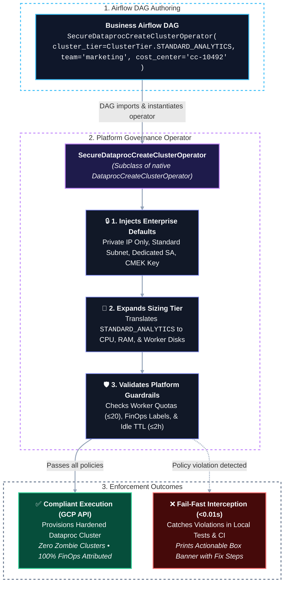
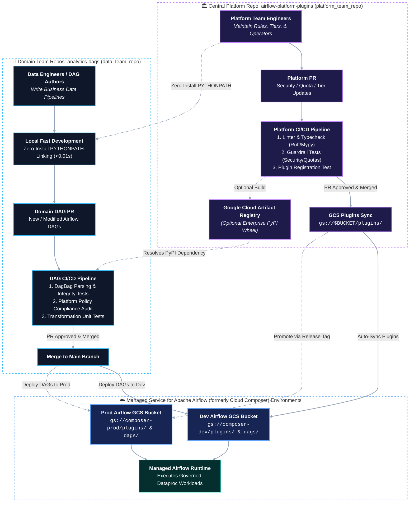

# Apache Airflow: Enterprise Governance & Standardization with Custom Plugin Operators

## Overview

In enterprise data platforms powered by **Apache Airflow** (including **Managed Service for Apache Airflow (formerly Cloud Composer)** on GCP), platform teams need to balance **developer velocity** with **security, compliance, and cost governance**. When data engineering teams provision cloud compute and data services (such as Google Cloud Dataproc, Google Kubernetes Engine, BigQuery, or Vertex AI), giving individual pipeline authors unrestricted access to raw configuration dictionaries introduces severe organizational risks:

* **Security & Compliance Violations:** Compute resources deployed with public external IPs, unapproved subnets, default Compute Engine service accounts with broad IAM roles, or missing Customer Managed Encryption Keys (CMEK).
* **Cost Runaway & Zombie Resources:** Clusters provisioned without automatic idle timeouts (`idle_delete_ttl`) or lifetime caps, leading to 24/7 billing for unused resources.
* **FinOps Blindspots:** Missing or inconsistent cost-allocation labels (`cost_center`, `team`, `environment`), rendering cloud billing attribution impossible.
* **Developer Friction & Configuration Drift:** DAG authors copying and pasting 100+ lines of complex nested Protobuf dictionaries across hundreds of pipelines.

**This utility demonstrates how enterprise platform engineering teams can solve these challenges by building and deploying custom Airflow Plugin Operators—using Google Cloud Dataproc as a showcase implementation.**

> 🎓 **Looking for the step-by-step interactive lab?**  
> Check out the **[Hands-On Workshop Guide](file:///Users/palakpatel/Documents/playground/composer-utilities/plugin_operators/workshop_guide.md)** for a guided 3-Act lab covering failure scenarios, sub-second local testing, and compliant production deployment.

---

## Architecture: How Platform Plugin Operators Work

By subclassing `DataprocCreateClusterOperator` into `SecureDataprocCreateClusterOperator`, the platform team creates an abstraction layer that:
1. **Encapsulates Enterprise Defaults:** Injects security settings (Private IP only, standard subnets, dedicated SAs, CMEK keys) automatically.
2. **Provides T-Shirt Sizing Tiers:** Exposes pre-approved cluster tiers (`DEV_SINGLE_NODE`, `SMALL_ANALYTICS`, `STANDARD_ANALYTICS`, `HIGH_MEMORY_ETL`).
3. **Enforces Non-Negotiable Guardrails:** Validates cluster specifications at initialization and execution time, failing fast with actionable error messages if rules are breached.
4. **Dramatically Improves Developer Experience (DX):** Reduces 120 lines of raw JSON/Protobuf dictionary configuration to **10 lines** of clean, business-focused DAG code.



---

## Comparison: Governance Mechanisms in Apache Airflow

| Governance Approach | Scope | Developer Experience | Prevention vs Interception | Best Use Case |
| :--- | :--- | :--- | :--- | :--- |
| **Plugin Operators (Subclassing)** | Specific Cloud Services (e.g. Dataproc, GKE, BigQuery) | **Exceptional** (T-Shirt sizing, 90% boilerplate reduction, sensible defaults) | **Proactive Prevention & Fail-Fast Interception** | **Standardizing complex cloud infrastructure provisioning across teams** |
| **Airflow Cluster Policies** (`airflow_local_settings.py`) | Global DAG / Task / Pod mutation | Invisible to DAG authors (mutates tasks under the hood) | Intercepts at DAG parsing time | Mutating Pod specs, capping timeouts, enforcing DAG tags (see companion [`composer_cluster_policy`](../composer_cluster_policy)) |
| **Custom CI/CD Linters & Scanners** | Git Repository / Pull Request | Out-of-band feedback during code review | Static code analysis | Enforcing syntax rules, import compliance, and blocking forbidden operators |
| **GCP Organization Policies** | GCP Project / Organization | Hard cloud API rejections at runtime | Runtime denial by GCP Resource Manager | Organization-wide baseline security policies |

---

## Platform Guardrails & Policy Matrix

The `SecureDataprocCreateClusterOperator` enforces the following guardrails:

| Category | Rule ID | Platform Policy | Enforcement Mechanism |
| :--- | :--- | :--- | :--- |
| **Security** | `RULE_SEC_001` | **Private IP Only (No Public IPs)** | Forces `internal_ip_only=True`. Rejects any configuration attempting to expose public IPs. |
| **Security** | `RULE_SEC_002` | **Block Default Compute Service Account** | Rejects default Compute Engine SA (`*-compute@developer.gserviceaccount.com`). Requires dedicated least-privilege SA. |
| **Security** | `RULE_SEC_003` | **Mandatory Production CMEK Encryption** | Automatically injects Customer Managed Encryption Key (`dataproc-cmek-key`) in production environments. |
| **Security** | `RULE_SEC_004` | **Approved Dataproc Image Versions** | Restricts images to platform-certified Debian/Ubuntu LTS versions (e.g. `2.2-debian12`, `2.1-debian11`). |
| **Networking** | `RULE_NET_001` | **Approved Subnetwork Boundary** | Validates fully qualified subnetwork URI matching enterprise VPC standards. |
| **Cost & FinOps** | `RULE_FIN_001` | **Mandatory Team Attribution** | Rejects cluster creation if `team` metadata is omitted. |
| **Cost & FinOps** | `RULE_FIN_002` | **Mandatory Cost Center Code** | Rejects cluster creation if `cost_center` is missing. Formats and validates GCP label compliance. |
| **Cost & FinOps** | `RULE_FIN_003` | **Environment Allowlist** | Ensures `environment` is in approved list (`dev`, `staging`, `production`). |
| **Cost & FinOps** | `RULE_FIN_004` | **Data Classification** | Mandates classification (`public`, `internal`, `confidential`, `restricted`). |
| **Lifecycle** | `RULE_LIFE_001` | **Mandatory Idle Auto-Deletion (`idle_delete_ttl`)** | Injects automatic idle termination (e.g. 30-90 minutes). Eliminates zombie cluster cloud spend. |
| **Lifecycle** | `RULE_LIFE_002` | **Maximum Cluster Lifespan (`auto_delete_ttl`)** | Enforces maximum absolute cluster lifetime (max 12 hours). |
| **Resource Quotas** | `RULE_QUOTA_001` | **Master Node HA Bounds** | Validates master node count (must be 1 for single/standard or 3 for High Availability). |
| **Resource Quotas** | `RULE_QUOTA_002` | **Worker Node Quota Caps** | Caps primary worker count at platform limit (20 workers). Prevents accidental quota exhaustion. |
| **Resource Quotas** | `RULE_QUOTA_004` | **Restricted Machine Types** | Prohibits unauthorized high-cost GPU/TPU machine types (`a2-`, `g2-`, `m1-`, `m2-`). |
| **Governance** | `RULE_GOV_001` | **Prohibit Raw Native Compute Operators** | CI/CD Static Governance Scanner (`test_dag_compliance.py`) intercepts direct use of raw `DataprocCreateClusterOperator`, blocking DAG merge. |

---

## Standardized Cluster Sizing Tiers

Instead of writing custom node counts, machine types, and disk specifications, DAG authors select from platform-approved tiers:

```python
from operators.secure_dataproc_operator import ClusterTier
```

| Tier Name | Master Nodes | Worker Nodes | Spot / Preemptible Workers | Disk per Node | Idle TTL | Auto-Delete Max | Ideal Use Case |
| :--- | :--- | :--- | :--- | :--- | :--- | :--- | :--- |
| `DEV_SINGLE_NODE` | 1x `e2-standard-4` | 0 (Single Node) | 0 | 50 GB | 30 mins | 4 hours | Dev prototyping, unit testing, low-cost ad-hoc jobs |
| `SMALL_ANALYTICS` | 1x `n2-standard-4` | 2x `n2-standard-4` | 0 | 100 GB | 60 mins | 8 hours | Hourly batch jobs, light analytical transformations |
| `STANDARD_ANALYTICS` | 1x `n2-standard-8` | 4x `n2-standard-8` | 2x `n2-standard-8` (Spot) | 200 GB | 90 mins | 8 hours | Standard production enterprise Spark/ETL pipelines |
| `HIGH_MEMORY_ETL` | 3x `n2-highmem-8` (HA) | 8x `n2-highmem-8` | 4x `n2-highmem-8` (Spot) | 300 GB | 120 mins | 12 hours | High-memory aggregations, large-scale ML data prep |
| `CUSTOM_GUARDED` | Custom | Custom (capped at 20) | Custom (capped at 20) | Capped at 500 GB | Enforced | Enforced | Custom pipelines with strict platform boundary validation |

---

## Developer Experience: Before vs. After

### ❌ Before: Unstandardized Raw Operator (120+ Lines of Boilerplate)
```python
# Unstandardized, error-prone, violates security (public IP) & misses idle TTL
create_cluster = DataprocCreateClusterOperator(
    task_id="create_cluster",
    project_id="my-project",
    region="us-central1",
    cluster_name="my-cluster",
    cluster_config={
        "gce_cluster_config": {
            "subnetwork_uri": "projects/my-project/regions/us-central1/subnetworks/my-subnetwork",
            "internal_ip_only": False,  # ⚠️ SECURITY RISK: Public IP exposed!
            "service_account": "123456-compute@developer.gserviceaccount.com",  # ⚠️ RISKY: Default SA
            "tags": ["dataproc"],
        },
        "master_config": {
            "num_instances": 1,
            "machine_type_uri": "n2-standard-8",
            "disk_config": {"boot_disk_size_gb": 500, "boot_disk_type": "pd-standard"},
        },
        "worker_config": {
            "num_instances": 50,  # ⚠️ COST RISK: Oversized worker count!
            "machine_type_uri": "n2-standard-8",
            "disk_config": {"boot_disk_size_gb": 500, "boot_disk_type": "pd-standard"},
        },
        "software_config": {
            "image_version": "1.5-debian10",  # ⚠️ OUTDATED: Unsupported image
        },
        # ⚠️ MISSING lifecycle_config: Cluster will run 24/7 forever if job fails!
        # ⚠️ MISSING cost_center, team, data_classification labels!
    },
)
```

### ✅ After: Platform Governed Plugin Operator (10 Lines)
```python
from operators.secure_dataproc_operator import ClusterTier, SecureDataprocCreateClusterOperator

# Clean, declarative, automatically hardened and FinOps compliant!
create_cluster = SecureDataprocCreateClusterOperator(
    task_id="create_governed_dataproc_cluster",
    project_id="my-enterprise-data-project",
    region="us-central1",
    cluster_name="analytics-batch-{{ ds_nodash }}",
    tier=ClusterTier.STANDARD_ANALYTICS,  # Injects 4 primary + 2 spot workers
    team="marketing-analytics",           # Mandatory FinOps tracking
    cost_center="cc-10492",               # Mandatory billing attribution
    environment="production",             # Auto-injects production CMEK encryption
    data_classification="confidential",
    idle_delete_ttl_minutes=60,           # Guaranteed auto-deletion when idle
)
```

---

## Decoupled Repository Structure (Enterprise CI/CD Replication)

To mirror a real-world enterprise CI/CD multi-repository architecture for workshops and demonstrations, the code is organized into two distinct repositories:

```
plugin_operators/
├── README.md                                              # Workshop guide & architecture documentation
│
├── platform_team_repo/                                    # 🏛️ REPO A: Platform Engineering Repository
│   ├── README.md                                          # Platform team guide & policy rules
│   ├── plugins/                                           # Deployed to gs://$BUCKET/plugins/
│   │   ├── __init__.py
│   │   ├── dataproc_governance_plugin.py                  # AirflowPlugin class
│   │   ├── config/
│   │   │   ├── __init__.py
│   │   │   ├── cluster_tiers.py                           # Sizing tiers (DEV, SMALL, STANDARD, HIGH_MEM)
│   │   │   └── governance_rules.py                        # Platform limits, allowed subnets, mandatory labels
│   │   ├── exceptions/
│   │   │   ├── __init__.py
│   │   │   └── policy_violations.py                       # Fail-fast actionable error exceptions
│   │   └── operators/
│   │       ├── __init__.py
│   │       ├── secure_dataproc_operator.py                # Governed Dataproc Create/Delete operators
│   │       └── dataproc_job_operator.py                   # Governed Dataproc Submit Job operator
│   └── tests/                                             # Platform Unit Tests
│       ├── __init__.py
│       ├── test_cluster_tiers.py                          # Sizing template & builder tests
│       ├── test_guardrail_enforcement.py                  # Security, Quota, FinOps & Lifecycle tests
│       ├── test_secure_dataproc_operator.py               # Operator lifecycle & execution tests
│       └── test_dag_compliance.py                         # Platform CI static compliance & raw operator linter tests
│
└── data_team_repo/                                        # 💼 REPO B: Domain Data Team DAG Repository
    ├── README.md                                          # Data team guide & local testing instructions
    ├── dags/                                              # Deployed to gs://$BUCKET/dags/
    │   ├── sample_secure_dataproc_dag.py                  # Production governed Dataproc ETL pipeline
    │   └── sample_guardrail_violation_dag.py              # Demonstration of guardrail fail-fast interception
    └── tests/                                             # Data Team DAG Tests
        ├── __init__.py
        └── test_dag_integrity.py                          # DAG validation & DagBag parsing tests
```

---

## Deployment to Managed Service for Apache Airflow (formerly Cloud Composer)

### Step 1: Identify Your Airflow Environment Storage Bucket
```bash
export COMPOSER_ENVIRONMENT="your-composer-environment-name"
export LOCATION="us-central1"

# Extract the Cloud Storage bucket associated with your Airflow environment
export BUCKET=$(gcloud composer environments describe $COMPOSER_ENVIRONMENT \
    --location=$LOCATION \
    --format="value(storageConfig.bucket)")

echo "Airflow Environment GCS Bucket: gs://$BUCKET"
```

### Step 2: Deploy Platform Plugins (from `platform_team_repo`)
Upload the platform plugin directory to the environment's plugins storage:
```bash
gcloud storage cp -r plugin_operators/platform_team_repo/plugins/* gs://$BUCKET/plugins/
```

### Step 3: Deploy Domain DAGs (from `data_team_repo`)
Upload the data pipelines to the environment's DAGs folder:
```bash
gcloud storage cp -r plugin_operators/data_team_repo/dags/* gs://$BUCKET/dags/
```

---

## Workshop Live Demo: Fast Local Development & Unit Testing

In a live workshop setting, you can showcase how both teams develop and test their code independently with **zero cloud latency (< 0.01s)**:

### 1. Platform Team Demo: Testing Governance & Guardrails
Demonstrate how platform engineers verify security rules, sizing tiers, and guardrails (< 0.01s):

```bash
# From repository root:
python3 -B -m unittest discover -s plugin_operators/platform_team_repo/tests -v

# (OR from inside platform_team_repo/):
cd plugin_operators/platform_team_repo
python3 -B -m unittest discover -s tests -v
```

### 2. Data Team Demo: Zero-Install `PYTHONPATH` Linking
Demonstrate how data engineers test their DAGs locally by pointing `PYTHONPATH` to the platform plugins with **zero package installation overhead**:

```bash
# From repository root:
export PYTHONPATH="$(pwd)/plugin_operators/platform_team_repo/plugins:$PYTHONPATH"
python3 -B -m unittest discover -s plugin_operators/data_team_repo/tests -v

# (OR from inside data_team_repo/):
cd plugin_operators/data_team_repo
export PYTHONPATH="../platform_team_repo/plugins:$PYTHONPATH"
python3 -B -m unittest discover -s tests -v
```

### 3. Interactive Workshop Test Dashboard (All-in-One)
Run the zero-dependency colored test dashboard to execute and present both test suites in a single unified view (< 0.02s):

```bash
# Run unified colored test dashboard:
python3 plugin_operators/run_tests.py

# Optional flags:
# python3 plugin_operators/run_tests.py -v                # Detailed test-by-test breakdown
# python3 plugin_operators/run_tests.py --scope=platform  # Platform tests only
# python3 plugin_operators/run_tests.py --scope=data      # Data team DAG tests only
# python3 plugin_operators/run_tests.py -b                # Display visual error box banners
```

### Dashboard Output Preview:
```text
==================================================================================
🧪  APACHE AIRFLOW ENTERPRISE GOVERNANCE TEST DASHBOARD
==================================================================================
📍 Execution Mode: Scope=ALL | Zero Cloud Latency Mode (< 0.01s)

🏛️  PLATFORM ENGINEERING DOMAIN (platform_team_repo):
   ✔  Cluster Sizing Tiers         (5/5 tests)    [0.0001s]  --> PASS
   ✔  Guardrails & Policies        (16/16 tests)  [0.0005s]  --> PASS
   ✔  Operator Lifecycle           (4/4 tests)    [0.0002s]  --> PASS

💼  DATA ENGINEERING PIPELINES (data_team_repo):
   ✔  DAG Parsing & Integrity      (3/3 tests)    [0.0005s]  --> PASS
   ✔  Platform Policy Compliance   (3/3 tests)    [0.0002s]  --> PASS

----------------------------------------------------------------------------------
🎉  ALL 31 GOVERNANCE & INTEGRITY TESTS PASSED (100% Success in 0.0315s)
==================================================================================
```

---

## Actionable Error Messages (Fail-Fast Guidance)

When a DAG author configures a cluster that breaches platform policies, the operator halts before submitting any API calls to Google Cloud and outputs a structured remediation guide directly in the Airflow task / parse logs:

```
╔═══════════════════════════════════════════════════════════════════════════════════════════
║ [PLATFORM GOVERNANCE VIOLATION] RULE_SEC_001: PRIVATE_IP_ONLY_ENFORCEMENT
╠═══════════════════════════════════════════════════════════════════════════════════════════
║ Description : Dataproc clusters must NOT have public IP addresses. internal_ip_only must be True.
║ Provided    : internal_ip_only=False
║ Permitted   : internal_ip_only=True
║ Remediation : Ensure gce_cluster_config.internal_ip_only is set to True (enforced automatically by tier).
╚═══════════════════════════════════════════════════════════════════════════════════════════
```

---

## Enterprise CI/CD Lifecycle & Multi-Repository Architecture

In mature enterprise data platform environments, decoupling platform governance infrastructure from business DAG authoring is critical for security, scalability, and developer velocity.

### Multi-Repository Architecture & CI/CD Diagram



---

## Frequently Asked Questions (FAQs)

For detailed architectural and developer guidance on repository separation, automated CI/CD PR testing, and multi-repo unit testing workflows, refer to the dedicated **[FAQs.md](FAQs.md)** file.

---

## Summary & Key Takeaways

1. **Platform Standardization:** Custom plugin operators allow platform teams to encode enterprise compliance, networking, security, and FinOps standards directly into the operator class.
2. **Cost Prevention:** Enforcing mandatory `idle_delete_ttl` and maximum worker quotas prevents accidental cloud overspend and zombie clusters.
3. **Developer Velocity:** Data engineers focus purely on analytical transformation logic without needing deep expertise in complex GCP infrastructure configurations.
4. **Decoupled Governance:** Decoupling platform operators into a dedicated repository with automated CI/CD provides rock-solid security boundaries, semantic versioning, and unified distribution across all Managed Service for Apache Airflow (formerly Cloud Composer) environments.
5. **Frictionless Local Testing:** Data engineers test DAGs locally in `< 0.05s` using versioned Artifact Registry packages or `pip install -e` editable co-development links with zero cloud latency.


