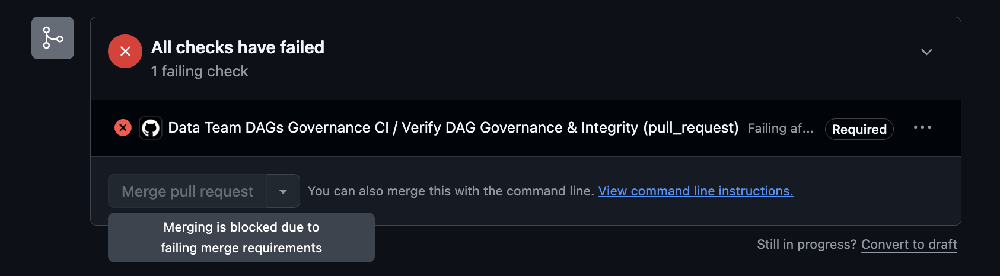
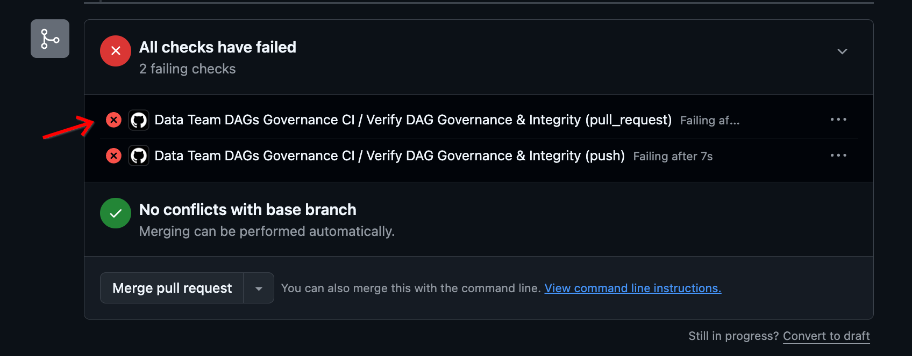
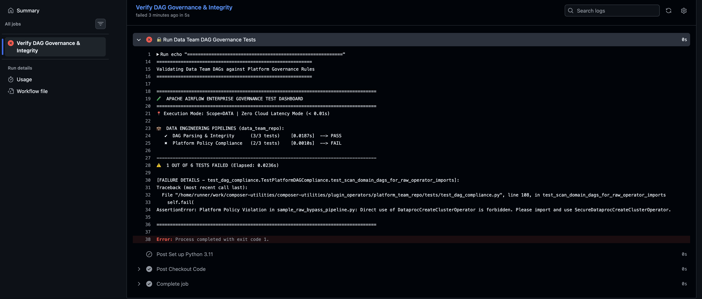
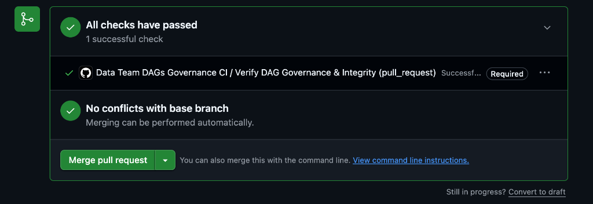

# Hands-On Workshop Guide: Enterprise Airflow Custom Plugin Operators

Welcome to the hands-on lab! In this workshop, you will experience firsthand how **Custom Plugin Operators** in **Managed Service for Apache Airflow (formerly Cloud Composer)** empower platform teams to enforce enterprise security, FinOps cost attribution, and resource quotas—while reducing 120+ lines of data engineering infrastructure boilerplate down to **10 clean lines of code**.

---

## 🎯 Lab Objectives

During this 30-minute hands-on session, you will:
1. **Experience Failure Scenarios (Act 1):** Trigger and inspect real-world security, FinOps, and quota policy violations intercepted with actionable remediation banners.
2. **Experience Sub-Second Local CI/CD Feedback (Act 2):** Introduce a policy violation in code, observe immediate failure in `<0.01s` in local tests, and fix it self-service.
3. **Execute the End-to-End Compliant Production Pipeline (Act 3):** Deploy and run a fully governed Dataproc Spark pipeline, verifying automated Private IP, FinOps tagging, and idle auto-delete lifecycle controls in Google Cloud Console.

```
┌────────────────────────────────────────┐     ┌────────────────────────────────────────┐     ┌────────────────────────────────────────┐
│  ACT 1: The "Rogue" Pipeline           │ ──► │  ACT 2: Sub-Second Local CI/CD         │ ──► │  ACT 3: Compliant Production Pipeline  │
│  • Trigger Guardrail Violations        │     │  • Introduce intentional code error    │     │  • Deploy 10-line governed DAG         │
│  • Inspect Actionable Error Banners    │     │  • Fail-fast in <0.01s local test      │     │  • Verify Private IP, FinOps & TTL in  │
│  • See how cloud runaway is prevented  │     │  • Self-service fix in 1 line          │     │    Google Cloud Dataproc Console       │
└────────────────────────────────────────┘     └────────────────────────────────────────┘     └────────────────────────────────────────┘
```

---

## 🛠️ Step 0: Environment Setup (2 mins)

Open your terminal or Google Cloud Shell and set your environment variables:

```bash
# 1. Set your GCP Project ID, Region, and Airflow Environment Name
export PROJECT_ID=$(gcloud config get-value project)
export REGION="us-central1"
export COMPOSER_ENV="<your-composer-environment-name>"  # e.g., my-composer-env

# 2. Extract your Managed Service for Apache Airflow GCS storage bucket
export BUCKET=$(gcloud composer environments describe $COMPOSER_ENV \
  --location=$REGION \
  --format="value(storageConfig.bucket)")

echo "Project ID : $PROJECT_ID"
echo "GCS Bucket : $BUCKET"
```

### Sync Platform Plugins to Managed Service for Apache Airflow

Deploy the platform governance plugin to your Managed Service for Apache Airflow (formerly Cloud Composer) environment:

```bash
# Deploy platform plugin operators and governance rules
gcloud storage cp -r plugin_operators/platform_team_repo/plugins/* gs://$BUCKET/plugins/
```

---

## 🚨 Act 1: The "Rogue" Pipeline (Hands-On Failure Scenarios)

In this exercise, you will observe how the custom operator acts as an active **guardrail**, intercepting insecure or cost-prohibitive configurations before any Google Cloud compute resources are requested.

### Step 1.1: Deploy the Guardrail Violation Demo DAG

```bash
gcloud storage cp plugin_operators/data_team_repo/dags/sample_guardrail_violation_dag.py gs://$BUCKET/dags/
```

### Step 1.2: Trigger the DAG in the Airflow UI

1. Open the **Airflow Web UI** from the Google Cloud Console.
2. Search for the DAG: **`sample_dataproc_guardrail_enforcement_demo`**.
3. Unpause the toggle switch and click the **Trigger DAG (▶)** button.

### Step 1.3: Inspect the Policy Violation Logs

Click on each task in the Graph view and inspect the **Logs**:

#### 1. Task: `verify_public_ip_guardrail` (Security Violation)
* **What happened:** A developer attempted to set `internal_ip_only: False` to attach a public external IP.
* **The Guardrail Output:** The operator blocked cluster instantiation with `RULE_SEC_001`:

```text
╔═══════════════════════════════════════════════════════════════════════════════════════════
║ [PLATFORM GOVERNANCE VIOLATION] RULE_SEC_001: PRIVATE_IP_ONLY_ENFORCEMENT
╠═══════════════════════════════════════════════════════════════════════════════════════════
║ Description : Dataproc clusters must NOT have public IP addresses. internal_ip_only must be True.
║ Provided    : internal_ip_only=False
║ Permitted   : internal_ip_only=True
║ Remediation : Ensure gce_cluster_config.internal_ip_only is set to True (enforced automatically by tier).
╚═══════════════════════════════════════════════════════════════════════════════════════════
```

#### 2. Task: `verify_finops_label_guardrail` (Cost Tracking Violation)
* **What happened:** A pipeline omitted the mandatory `cost_center` parameter.
* **The Guardrail Output:** The operator rejected the cluster with `RULE_FIN_002`, guaranteeing 100% cost attribution for cloud billing.

#### 3. Task: `verify_quota_guardrail` (Resource Quota Violation)
* **What happened:** A user requested **100 worker nodes**, which exceeds the platform limit (max 20).
* **The Guardrail Output:** The operator blocked the request with `RULE_QUOTA_002`, preventing thousands of dollars in accidental cloud spend before calling the GCP API!

---

### 🚨 Exercise 1B: Catching Raw Operator Bypasses (Local Testing & GitHub CI)

What happens if a developer attempts to bypass the platform plugin and directly import Apache Airflow's native `DataprocCreateClusterOperator`?

#### Step 1.4: Simulate a "Shadow IT" Bypass DAG
Run this single command in your terminal to generate an unhardened pipeline importing the raw native operator:

```bash
cat << 'EOF' > plugin_operators/data_team_repo/dags/sample_raw_bypass_pipeline.py
from datetime import datetime
from airflow import DAG
from airflow.providers.google.cloud.operators.dataproc import DataprocCreateClusterOperator

with DAG(dag_id="sample_raw_bypass_pipeline", schedule=None, start_date=datetime(2026, 1, 1)) as dag:
    # ❌ SHADOW IT ATTEMPT: Direct use of raw native operator without governance
    create_cluster = DataprocCreateClusterOperator(
        task_id="create_unhardened_cluster",
        project_id="my-enterprise-project",
        region="us-central1",
        cluster_name="rogue-cluster",
        cluster_config={
            "master_config": {"num_instances": 1, "machine_type_uri": "n1-standard-4"},
        },
    )
EOF
```

#### Step 1.5: Run Local Unit Testing (< 0.01s Interception)
Run your local test suite before pushing or committing:

```bash
python3 -B plugin_operators/run_tests.py
```

* **Observation:** The platform's compliance suite immediately catches the raw operator in **`< 0.03 seconds`** and fails:

```text
[FAILURE DETAILS - test_dag_compliance.TestPlatformDAGCompliance.test_scan_domain_dags_for_raw_operator_imports]:
AssertionError: Platform Policy Violation in sample_raw_bypass_pipeline.py: Direct use of DataprocCreateClusterOperator is forbidden. Please import and use SecureDataprocCreateClusterOperator.
```

#### Step 1.6: How GitHub Actions CI Blocks the Pull Request
If a developer pushes this branch to GitHub:

1. The **GitHub Action** (`.github/workflows/data_team_dags_ci.yml`) automatically triggers on the `data_team_repo/**` path.
2. The workflow executes `python3 -B plugin_operators/run_tests.py --scope data`.
3. The CI check **fails and blocks the Pull Request from merging**:

* **With GitHub Branch Protection enabled:** Merging is strictly disabled with a `Required` badge:



> **Note:** If GitHub Branch Protection rules are not yet configured on your repository, you will still see the failing status check indicator:
> 
> 

* **Detailed CI Failure Logs in GitHub Actions:**



#### Step 1.7: Clean Up & Verify Restored Compliance
Delete the temporary bypass DAG and re-run tests:

```bash
rm plugin_operators/data_team_repo/dags/sample_raw_bypass_pipeline.py
python3 -B plugin_operators/run_tests.py
```

* **Result:** `🎉 ALL 31 GOVERNANCE & INTEGRITY TESTS PASSED (100% Success in 0.03s)`.

Once pushed, GitHub Actions CI verifies the restored compliance, all checks pass successfully, and the Pull Request is unblocked and ready to merge:



---

## ⚡ Act 2: Sub-Second Local CI/CD Feedback (Developer Experience)

In this exercise, you will experience how data engineers get **sub-second local feedback** on their laptops or in CI/CD before deploying code to Managed Service for Apache Airflow.

### Step 2.1: Run the Local Governance Test Dashboard

Run the enterprise unit test dashboard in your terminal:

```bash
python3 -B plugin_operators/run_tests.py
```

* **Observation:** Notice the execution time: **all 31 governance tests pass in `< 0.04 seconds`** with zero cloud API latency!

### Step 2.2: Introduce an Intentional Policy Violation

Open `plugin_operators/data_team_repo/dags/sample_secure_dataproc_dag.py` in your code editor.

Locate line 136 and temporarily change the `cost_center` to an empty string:

```python
    create_dataproc_cluster = SecureDataprocCreateClusterOperator(
        task_id="create_governed_dataproc_cluster",
        project_id=GCP_PROJECT_ID,
        region=GCP_REGION,
        cluster_name=CLUSTER_NAME,
        tier=ClusterTier.STANDARD_ANALYTICS,
        team="marketing-analytics",
        cost_center="",  # ❌ VIOLATION: Empty cost center
        environment="production",
        ...
```

### Step 2.3: Run the Test Runner Again

Run the test suite in your terminal:

```bash
python3 -B plugin_operators/run_tests.py
```

* **Observation:** The test runner **immediately fails** in `0.002s` and displays the exact remediation steps:

```text
[FAILURE DETAILS - test_dag_integrity.TestDataTeamDAGIntegrity.test_sample_secure_dataproc_dag_import]:
exceptions.policy_violations.MandatoryLabelMissingException: 
╔═══════════════════════════════════════════════════════════════════════════════════════════
║ [PLATFORM GOVERNANCE VIOLATION] RULE_FIN_002: MANDATORY_COST_CENTER_MISSING
╠═══════════════════════════════════════════════════════════════════════════════════════════
║ Description : Mandatory FinOps cost center label is missing.
║ Provided    : cost_center=''
║ Remediation : Provide a valid cost center code (e.g., cost_center='cc-10492').
╚═══════════════════════════════════════════════════════════════════════════════════════════
```

### Step 2.4: Self-Service Fix

Restore the cost center back to `"cc-10492"` in `sample_secure_dataproc_dag.py`:

```python
cost_center = "cc-10492"
```

Re-run the tests:

```bash
python3 -B plugin_operators/run_tests.py
```

* **Observation:** `🎉 ALL 31 GOVERNANCE & INTEGRITY TESTS PASSED (100% Success in 0.03s)`.

---

## 🚀 Act 3: End-to-End Compliant Production Pipeline (Success Scenario)

Now that our code is verified, let's deploy the 10-line governed production DAG to Managed Service for Apache Airflow (formerly Cloud Composer) and verify the provisioned infrastructure in Google Cloud.

### Step 3.1: Deploy the Compliant Production DAG

```bash
gcloud storage cp plugin_operators/data_team_repo/dags/sample_secure_dataproc_dag.py gs://$BUCKET/dags/
```

### Step 3.2: Trigger the Pipeline in Airflow UI

1. In the Airflow UI, find **`sample_secure_dataproc_etl_pipeline`**.
2. Click the **Trigger DAG (▶)** button.
3. Observe the task progression in the Graph view:
   * **`start_pipeline`** ➔ **`create_governed_dataproc_cluster`** ➔ **`run_pyspark_daily_aggregation`** ➔ **`delete_dataproc_cluster`** ➔ **`end_pipeline`**.

### Step 3.3: Verify Hardened Infrastructure in Google Cloud Console

While the cluster is running, navigate to the **Google Cloud Console ➔ Dataproc ➔ Clusters**:

1. Click on your active cluster: `analytics-batch-<date>`.
2. **Verify FinOps Labels:**
   * `team: marketing-analytics`
   * `cost_center: cc-10492`
   * `managed_by: airflow-platform-plugin`
3. **Verify Security & Networking:**
   * **Internal IP Only:** `Enabled` (No public IPs exposed).
   * **Subnetwork:** Bound to your project's private VPC subnet.
4. **Verify Lifecycle Protection:**
   * **Idle Auto-Delete (`idle_delete_ttl`):** `3600s` (1 hour).
   * Even if a downstream step crashes or a network disconnect occurs, Google Cloud Dataproc will automatically destroy the cluster after 1 hour of inactivity, eliminating "zombie cluster" billing!

### Step 3.4: Observe Clean Teardown

Back in the Airflow UI:
* The **`run_pyspark_daily_aggregation`** task computes Pi using Spark across the cluster and outputs `Pi is roughly 3.14159...` to driver logs.
* The **`delete_dataproc_cluster`** task executes with `trigger_rule="all_done"`, guaranteeing that the cluster is deleted after the job completes.

---

## 📊 Summary: Value Delivered

| Evaluation Metric | Raw Unstandardized Operator | Platform Governed Plugin Operator |
| :--- | :--- | :--- |
| **DAG Boilerplate** | 120+ lines of nested JSON/Protobuf | **10 clean lines of declarative Python** |
| **Error Feedback Latency** | 5–10 mins (Failed GCP API deployment) | **`< 0.01 seconds` (Local unit test / CI)** |
| **Security Baseline** | Manual (High risk of public IPs & wide SAs) | **Enforced by default** (Private IP, dedicated SA, VPC) |
| **Cost Control (Zombie Spend)**| Easy to omit `idle_delete_ttl` (24/7 billing)| **Guaranteed idle auto-termination** |
| **FinOps Cost Attribution** | Inconsistent or missing labels | **100% verified label compliance** |

---

## 🧹 Cleanup (Optional)

When you are done with the workshop:

```bash
# Delete workshop DAGs from Managed Service for Apache Airflow
gcloud storage rm gs://$BUCKET/dags/sample_guardrail_violation_dag.py
gcloud storage rm gs://$BUCKET/dags/sample_secure_dataproc_dag.py
```
